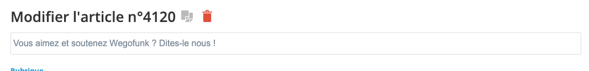

# Commentaires 

(Total : 1416 Commentaires)
Un exemple de commentaire dans le fichier xml de backup fourni par wmaker via la plateforme d'administration : 

```xml 
<wp:comment>
<wp:comment_id>3104702</wp:comment_id>
<wp:comment_author>Toto</wp:comment_author>
<wp:comment_author_email>email@email.email</wp:comment_author_email>
<wp:comment_author_url>http://www.monsite.com</wp:comment_author_url>
<wp:comment_author_IP>109.0.36.81</wp:comment_author_IP>
<wp:comment_date>2012-06-20 14:25:00</wp:comment_date>
<wp:comment_date_gmt>2012-06-20 16:25:00+02</wp:comment_date_gmt>
<wp:comment_content><![CDATA[C'est avec grand regret que je lis votre annonce de fermeture mais un très grand merci pour votre passion de la musique et pour tous les sons que j'ai pu découvrir sur votre site!]]></wp:comment_content>
<wp:comment_approved>1</wp:comment_approved>
<wp:comment_type></wp:comment_type>
<wp:comment_parent>4432604</wp:comment_parent>
<wp:comment_user_id></wp:comment_user_id>
</wp:comment>
```
`comment_parent` est l'id de l'entité sur lequel a été fait le commentaire, c'est-à-dire l'article qui a pour url 
https://www.wegofunk.com/Vous-aimez-et-soutenez-Wegofunk-Dites-le-nous-_a4120.html?preview=1
`<wp:post_id>4432604</wp:post_id>`

L'id `4120` est l'id du back office :


Pour retrouver l'id de l'article en base, c'est l'id de l'url du backoffice `https://www.wegofunk.com/admin/page/4432604/`

## Récupération de commentaire via api 
- url : https://api.wmaker.net/comment-get_a29.html
- Retourne un tableau avec les champs :
  - id : l'id de commentaire
    - object_id : l'id de l'objet associé (article, photo, produit boutique)
    - date : date d'ajout
    - email : adresse éléctronique
    - comment : commentaire
    - username : pseudonyme
    - url : adresse internet
    - type : type d'objet, peut être un article (vide), un produit de boutique("produit") ou une photo ("galerie")
    - status : etat de publication
    - highlight : défini si le commentaire doit être colorié différement (1) ou non (0
    - notify : défini si l'auteur souhaite être notifié des nouveaux commentaires
    - site_id :
    - source : défini si le commentaire provient d'un ordinateur("pc") ou d'un appareil mobile("phone")

Appel api : https://www.wegofunk.com/api/?api_key=API_KEY&api_sig=API_SIG&method=comment.get&format=json&id=3104849&

```json
{
  "id": "3104849",
  "object_id": "4432604",
  "date": "2012-06-20 15:10:00",
  "email": "email@email.email",
  "comment": "Bravo pour ces 12 années! C'était un travail d'acharné de monter ce site et l'entretenir.\r\nMerci de m'avoir permis d'en faire partie pendant un petit moment, ça m'a permis de rencontrer beaucoup de mes héros et participer à ce beau projet.\r\nGood luck for the next one.\r\nBeki xxx",
  "username": "Toto",
  "url": "",
  "type": "",
  "status": "",
  "highlight": "0",
  "notify": "0",
  "site_id": "6192",
  "source": "pc",
  "user_id": "0",
  "pers_id": "0",
  "prof_id": "0",
  "results": 1,
  "stat": "ok",
  "generated_in": "0.02"
}
```

La réponse en json contient moins d'informations que le xml.
Qu'est-ce que le site id ` "site_id": "6192",` et quelle est la pertinence de cette information ?